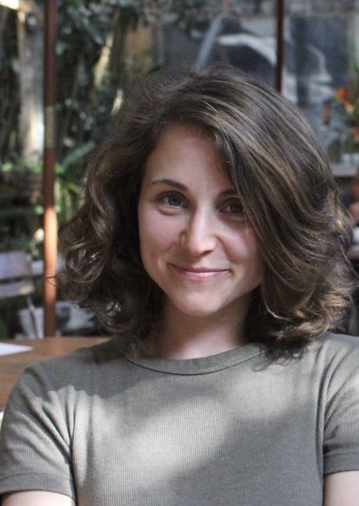

 
 
 
I am a third-year PhD student at University of California, Davis and a member of the Center for Environmental Policy, earning my degree in Ecology with a Designated Emphasis in Computational Social Science. For my dissertation I research how governance of seed systems impacts outcomes for biodiversity and social-ecological resilience, particularly in  the context of climate change. Beyond this, I also work on issues related to agricultural policy and farmer behavior in California's Central Valley, and enjoy teaching and being involved in R user groups on campus. Before coming to Davis, I worked at the College of Charleston in South Carolina, both as an administrator and instructor with first-year students, leading courses on local food systems in Charleston and Peru. I currently hold degrees in Sustainability Science and Policy (MSc), Organic Farming (MSc), and Biology and Political Science (BA). More in my [CV](cv.html).  

 
 
This website will soon include tutorials related to R, computation, and statistical topics I have learned throughout my time as PhD. I am enthusiastic about publicly sharing data and code to promote data and statistical literacy, particularly for early learners.