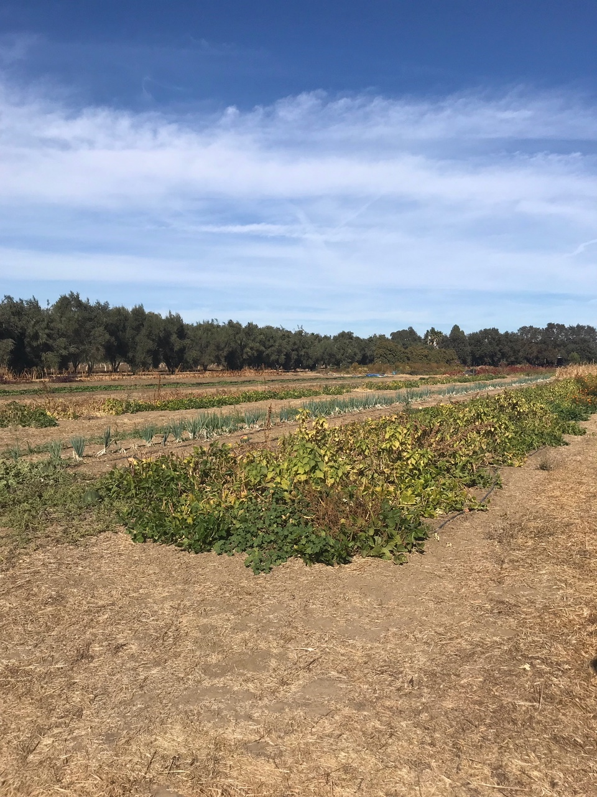
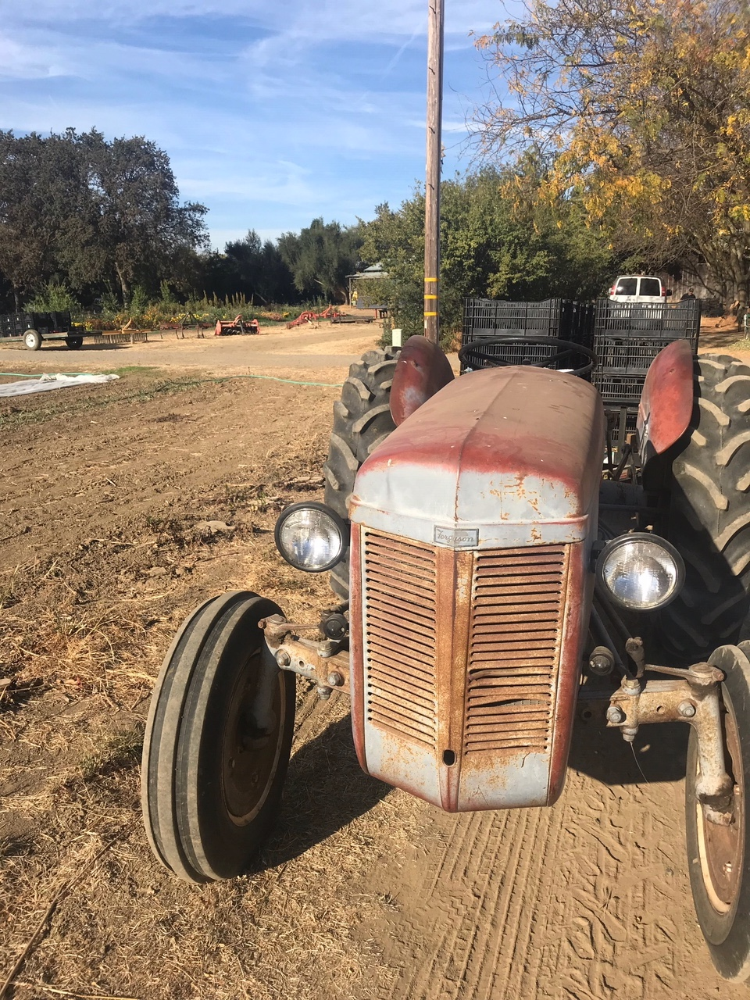

### {.tabset .tabset-fade}

#### Seed innovation systems

Seed systems -- the seed savers, breeders, producers, companies, and ag-innovation agencies that are responsible for supplying our agricultural system with seeds -- are complex networks that rely on coordination of information and resources across multiple stakeholders.  Little is known about the systems-level interactions that support such a system, and the organic sector faces particular challenges with regards to research & development, intellectual property protections, and supply chain reliability. My work in this field has three major components.  

Along with the Organic Seed Alliance, I am conducting network analyses of organic seed systems to better understand opportunities for increasing social-ecological resilience. This project is funded by the [Western Sustainable Agriculture Research and Education Program](https://projects.sare.org/sare_project/GW20-216/).  

Under sponsorship of the [John Muir Institute of the Environment](https://johnmuir.ucdavis.edu/), I am drawing on data from the Twitter API to better understand the landscape of the seed communication system more broadly.  

I will combine a series of unique data sets -- data from germplasm databases, seed company websites, and recent reporting from various public institutions -- to identify trends in the public and private movement of germplasm.  

#### Ag policy for environmental conservation

How policies affect farmer behavior to confront environmental challenges has major implications for the sustainability of the food system. Policies such as voluntary incentives and certification, mandatory reporting, and sponsored research support are just some of the approaches utilized by the US government. My work in this area looks at two different policy-environment interfaces: mandatory information-based policy tools for nitrogen management, and collaborative governance approaches for groundwater management.  

The Irrigated Lands Regulatory Program is a California policy that mandates engagement with information-based tools, particularly educational meetings and plan-writing. In this context we evaluate farmers surveys and use ordered logistic regression models to better understand the stages that farmers go through as they learn about nitrogen management.  

The Sustainable Groundwater Management Act (SGMA) has urged for localized collaborative governance solutions to achieving state-level groundwater sustainability goals. In coordination with California counties our work uses farmer surveys to evaluate farmers' perceptions of potential policy solutions and identifies ways to design policies that best help optimize farmer groundwater use.

#### Science in policy
 
Transportation and transit governance are highly technical practices. Agencies rely on a vast array of science and engineering inputs to design infrastructure, site and plan operations, and make policies. To understand how and where transportation and transit agencies use science, this project looks at scientific resources that state and regional transit agencies use for plans and projects. Transportation planning and project development processes generate large quantities of procedural documents -- plans, project proposals, and environmental assessments, which we analyze to extract and assess the nature and sources of science that informs transportation governance.  

This project focuses on methods including web scraping, large scale text analysis, pattern detection and dictionary building, and creation of relational databases to link agencies to additional environmental and political detail of the area.
