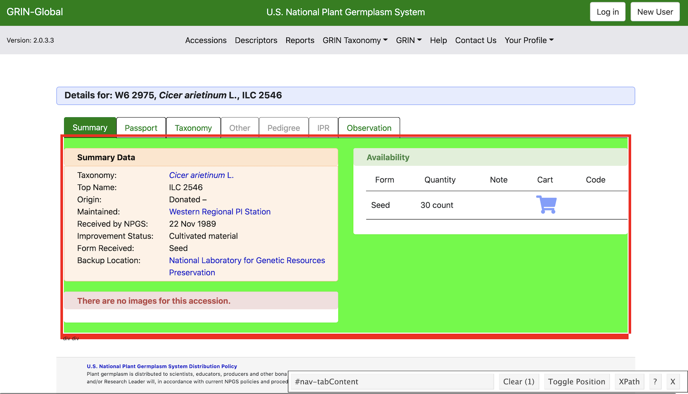
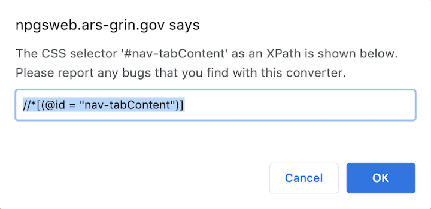
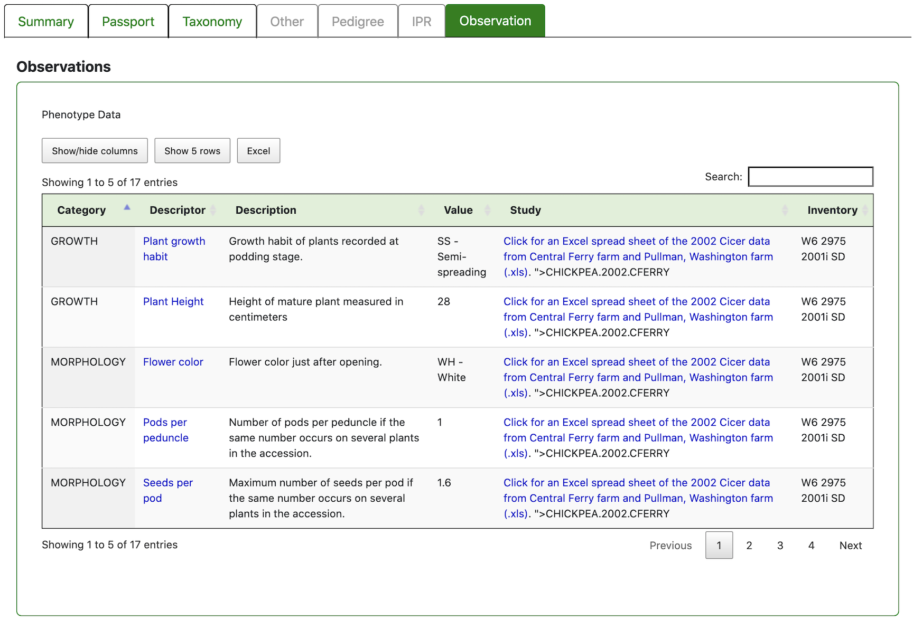

```{r, include=FALSE}
knitr::opts_chunk$set(echo = TRUE, results = TRUE)
```

## Scraping overview  
Approaches to web scraping can range from pretty advanced (e.g. crawling through webpages with a headless browser like [RSelenium](https://cran.r-project.org/web/packages/RSelenium/vignettes/basics.html)), to pretty basic but effective point and click browser extensions like [Web Scraper](https://webscraper.io/). Here I am going to review a middle of the road effort for pulling information from a database using `xml2` and `rvest`.  

To test these out, let's say we want to know all of the accessions in the [Germplasm Repository Information Network (GRIN)](https://npgsweb.ars-grin.gov/gringlobal/search) -- a database of plant germplasm hosted by the USDA. Like many databases, this repository houses data on tens of thousands of plant accessions, but does not provide the raw data used to populate this database. So, we can get it ourselves.  

First, let's load in the packages we will need -- `rvest` combined with `xml2` will be the workhorses here, and `stringr` will help us work with the text data from the website, along with some others.

```{r, message = F, results = F}
library(rvest)
library(xml2)
library(stringr)
library(data.table)
library(dplyr)
```

Next, a short overview of some of the main functions in `xml2`. First, `read_html()` takes the URL of a website of interest and grabs all of the HTML code associated with it. When stored as an object, it will be a list, usually of 2, representing the webpage's <head> and <body>, and nested within those items will be everything within the website. In fact, this list should mirror the HTML one can read when exploring the HTML of a webpage in the browser by using Cmd+Opt+i.  

Below, I won't start with the search webpage of GRIN, but of one particular accession from which we will model our scraping from: a chickpea variety currently in the system, *Cicer arietinum L.*, and one other to check that our scraping code will be consistent across accessions: a legume, *Helicotropis stenoloba*, which has historical data in the system.  

```{r}
html.chickpea <- read_html("https://npgsweb.ars-grin.gov/gringlobal/accessiondetail?id=1022773")
html.legume <- read_html("https://npgsweb.ars-grin.gov/gringlobal/accessiondetail?id=1020746")
```

By using `read_html()`, we have all of the information from the page, but we'll want to narrow it since everything is currently deeply nested in the code and basically un-usable. So, we will explore the `html_nodes()` and `html_text()` series in `rvest`, both of which pick out pieces of HTML documents using XPath and/or CSS selectors. For `html_nodes()` the arguments include the object to inspect (which can be a full HTML document or smaller nodes), and either the Xpath or CSS selector to extract particular kinds of information. For the `html_text()` series of functions, including `html_children()` and `html_attrs()`, you are specifying a desired attribute of the code, rather than an XPath or CSS object, that you want to extract. In the case of `html_text()`, the text attribute is already specified so you only need to include the object. For `html_children()`, it will convert the given object into an indexed list, allowing you to specify which part of the list to extract using indexing.  

## Extracting webpage components  
Now let's dig in. Let's say we want to generally extract all of the information from the tabs of the accession page. 

First, how do you get a CSS selector or Xpath? Widely recommended is [Selector Gadget](http://selectorgadget.com/), a web extension tool that allows you to point and click to get the paths easily. Let's see what this will look like on our page.  

Here we open the extension (the small bar in the middle right of the screen) and click to the objects on the webpage that we are interested in. I've clicked on the overall content of the page I want, and Selector Gadget automatically chooses the items it thinks compatible with your selection, turning them green and/or yellow. If it selects objects beyond what you want, you can click on them to un-select. The Selector Gadget bar will indicate how many objects the selector includes (in the case below, 1), and provide the CSS selector by default, which can be copied for use in your code.

```{r, echo=FALSE, out.width= "75%", fig.align= "center"}

```

If you want the Xpath, you just need to click on that button and the Xpath should pop up in a separate window.

```{r, echo=FALSE, out.width= "25%", fig.align= "center"}

```

Now, we can use this information in `html_nodes()`. Note that these functions work within pipes, which I prefer for readability. So, we can extract the whole of the content of interest, using the Xpath we identified above.

```{r}
content <- html.chickpea %>% 
  html_nodes(xpath = "//*[@id='nav-tabContent']")
content
```

It doesn't look like much yet, but we have no isolated the div where all the good information is housed. We could then index what is within content's components. Now we see that the content from above has been broken down into 7 subcategories.  

```{r}
content.children <- html_children(content)
content.children
```

Exploring each of these indices, we can use subsetting brackets to isolate components of the list, which match the tabs of the website. For the sake of this exercise, let's just take a look at one of the tabs.

```{r}
passport <- content.children[[2]] 
passport
```

Still, these don't give us much, either being read as a list, and if printed with `html_text()` we get a long string with plenty of spaces and breaks.

```{r}
html_text(passport)
```

But, we can use `stringr` to help clean this up. We can nest the text reading within a series of pattern removals, pattern replacements (replacing 2 or more spaces with a single space), and generic trimming of white space to isolate text.

```{r}
patterns.remove = c("\\n|\\r|\\t")
passport.text <- trimws(str_replace_all(str_remove_all(html_text(passport), patterns.remove), "\\s{2,}", " "))
passport.text
```

However, this is still a slog, and returns a bunch of text that would need waded through. Additionally, further refining this list through continued indexing may not apply well across accessions, because we are specifying an indexed location that could change depending on the information available in each page. While this larger-scale text extraction is useful in some scenarios, it isn't the best suited for this go. So, we can also use more specific CSS or Xpaths to get you where you want to be, and these are more transferable across examples. 

## Extraction, round 2  

Again, let's just get some of the information from the passport section. This time I have used Selector Gadget to identify the more specific components -- which we can tell from the more specific names. Also in this round I am using CSS selectors instead of Xpaths (it saves me a click and is a little less fussy given CSS paths don't use quotation marks). Here are the paths of some components of interest in the passport tab. 

```{r, warning = F}
taxonomy <- html.chickpea %>% 
  html_nodes(css = "#MainContent_ctrlSum_lblTaxon a") %>% html_text()
top.name <- html.chickpea %>% 
  html_nodes(css = "#MainContent_ctrlSum_lblTopName") %>% html_text()
maintained <- html.chickpea %>% 
  html_nodes(css = "#MainContent_ctrlSum_lblSite a") %>% html_text()
received <- html.chickpea %>% 
  html_nodes(css = "#MainContent_ctrlSum_lblReceived") %>% html_text()
status <- html.chickpea %>% 
  html_nodes(css = "#MainContent_ctrlSum_lblStatus") %>% html_text()
backup <- html.chickpea %>% 
  html_nodes(css = "#MainContent_ctrlSum_lblBackup a") %>% html_text()
```

Let's combine these components into a data table and have a look.  
```{r}
df <- data.table(taxonomy, top.name, maintained, received, status, backup)
head(df)
```
Now, before iterating this on thousands of accessions, it is worth testing it out on a few different examples to see how receptive these functions are to CSS paths that might not be present on other pages. So, can we duplicate this process with the legume accession?  

```{r, warning = F}
taxonomy <- html.legume %>% 
  html_nodes(css = "#MainContent_ctrlSum_lblTaxon a") %>% html_text()
top.name <- html.legume %>% 
  html_nodes(css = "#MainContent_ctrlSum_lblTopName") %>% html_text()
maintained <- html.legume %>% 
  html_nodes(css = "#MainContent_ctrlSum_lblSite a") %>% html_text()
received <- html.legume %>% 
  html_nodes(css = "#MainContent_ctrlSum_lblReceived") %>% html_text()
status <- html.legume %>% 
  html_nodes(css = "#MainContent_ctrlSum_lblStatus") %>% html_text()
backup <- html.legume %>% 
  html_nodes(css = "#MainContent_ctrlSum_lblBackup a") %>% html_text()

df <- data.table(taxonomy, top.name, maintained, received, status, backup)
head(df)
```

It looks like it, even though there are some attributes that don't have any values in this webpage. Note that `data.table()` is superior here because it will repeat information across rows if columns are differing lengths, and automatically fill a column with NAs if length is 0, whereas `data.frame()` will not.

## Repeating accross multiple accession IDs

Okay, now this code seems relatively ready to repeat across a large number of accession. The trick with this database, among many others, it that it can be challenging to know how many accessions there are, and what their URLs are. The GRIN database only lets you search for a certain number of items, given certain search terms. While there are more advanced ways around this, this is a somewhat cheap and easy route that I'll share here.  

We notice that the URLs for our example accessions are nearly the same, it is just the accession ID number that changes. From what we can tell, this is a 7 digit ID number and we can play around in the site to see a general range. Now, to be sure that you have extracted the whole database, one could run through **all** conceivable numbers, which would likely take an undesirable amount of computational time. But alternatively, you could define a generally wide range that seems right and go with that. Is it elegant? Not really. But does it accomplish the goal? Yes.  

But, instead of the tens of thousands of accessions that are likely in this database, let's give it a shot with just 150 accession IDs.  First, we can create a "base" URL which is the part of the URL that is shared across all pages. Next we can generate our range of IDs, which for now we will make between 1020001 and 1020250.

```{r, include = T, echo = T}
base <- "https://npgsweb.ars-grin.gov/gringlobal/accessiondetail?id="
ids <- seq(1020001, 1020150)
```

Then we can set up the string of CSS/Xpath selectors for easier looping.  

```{r}
css.text <- c("#MainContent_ctrlSum_lblTaxon a", 
              "#MainContent_ctrlSum_lblTopName", 
              "#MainContent_ctrlSum_lblSite a", 
              "#MainContent_ctrlSum_lblReceived", 
              "#MainContent_ctrlSum_lblStatus", 
              "#MainContent_ctrlSum_lblBackup a")
```

And last, set up our for loop to run through each webpage. This iteration includes 2 loops, one running through each accession IDs' webpage (i) and the second running through each selector (j). So for every accession ID, we will paste that to our base URL and read in the HTML. Then within each HTML, we will run through each CSS selector for the text we want and assign it into a list. While we could repeat the same concept as earlier (assigning each bit of text as an object and then combining them into a data.table), this process can really slow down the loop. So, we will assign each bit of text to a list, then unlist while making sure that we maintain the text elements that are empty, and transposing them. Combined with the accession, we have our final data table with all of our results. (Note: This loop takes about 10 minutes) 

```{r}

total.DT <- data.table()
text.l <- list()

for(i in ids){
  url <- tryCatch(read_html(paste0(base, i)),error = function(e) NULL)
    for(j in css.text){
    text.l[[j]] <- url %>% 
      html_nodes(css = j) %>% 
      html_text() 
    }
  unlisted.text <- data.table(t(data.table(unlist(lapply(text.l, function(x) 
    if(identical(x,character(0))) ' ' else x)))))
  accession <- i
  DT <- cbind(accession, unlisted.text)
  total.DT <- rbind(total.DT, DT)
}

colnames(total.DT) <- c("Accession", "Taxonomic name", "Code name", "Maintenance location", "Received", "Status", "Backup location")
```


```{r}
DT::datatable(total.DT, rownames = F)
```

## Tables?

One last note. What if there are tables embedded in webpages, and we would like to extract the table as is? For example, take a look at the Observation tab of the accession.

```{r, echo=FALSE, out.width= "75%", fig.align= "center"}

```


`xml2` provides a really clean way of doing this. We can use the `html_table()` function instead of `html_text()` to conveniently convert this table into a list

```{r}
obs.table <- html.chickpea %>% 
  html_nodes(xpath = "//*[@id='MainContent_ctrlObservation_gvPhen']") %>% 
  html_table()
```

Easily reproducible table: 
```{r}
DT::datatable(data.frame(obs.table), rownames = F)
```


